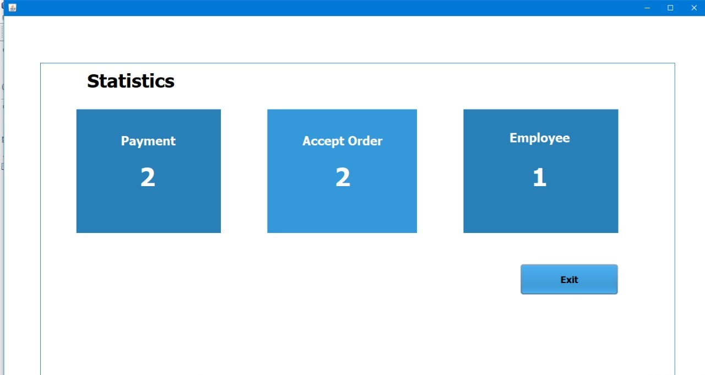
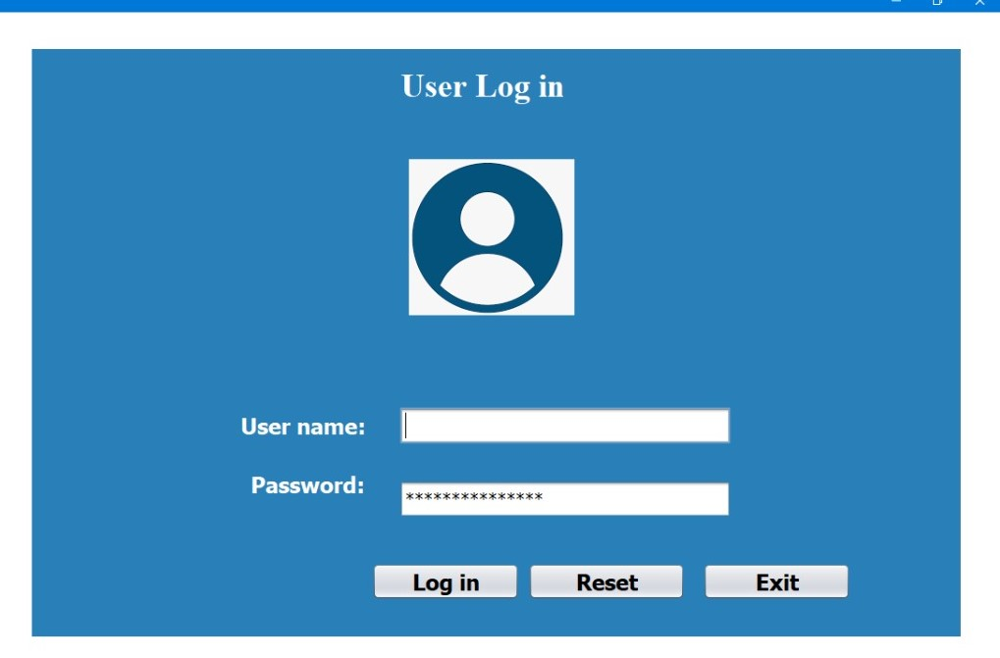
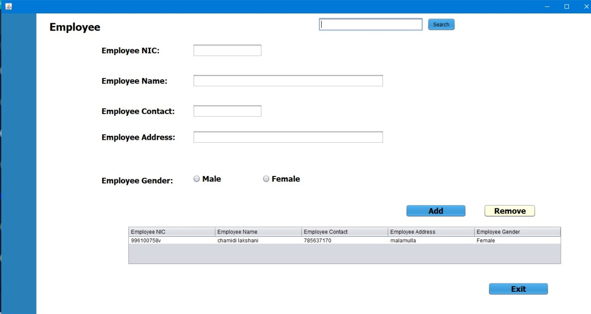
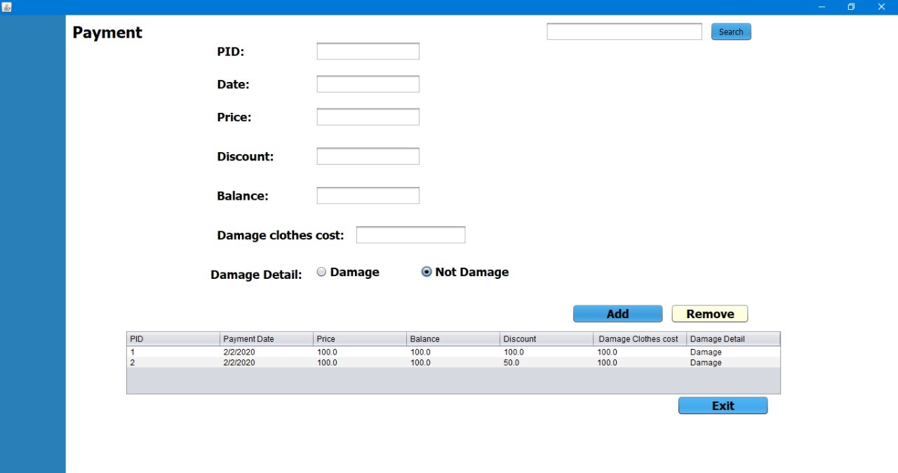
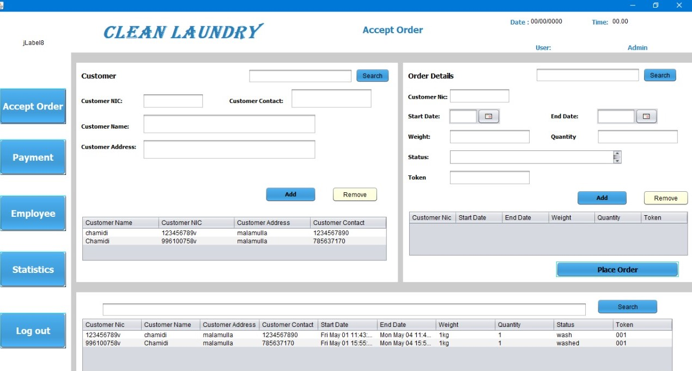

## Loundry-system

This is a Java application originally developed for IJSE first semester final exam. 
This application cover all activities in the laundry including add, delete, update and search order details, item details, customer details and employee details.

Technology: Java Spring

Architectural Design: Model View Controller Architecture
Duration: 1 month

### Screenshot

#

#

#

#

#
#### Developer by- Chamidi Lakshani Wijesuriya.

